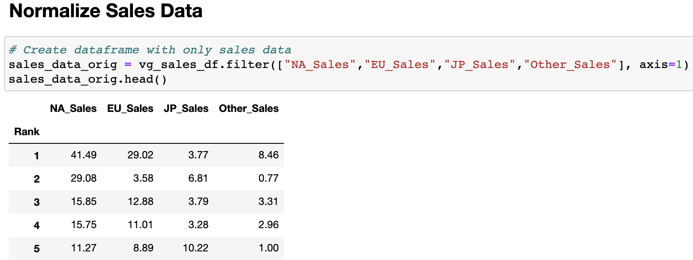
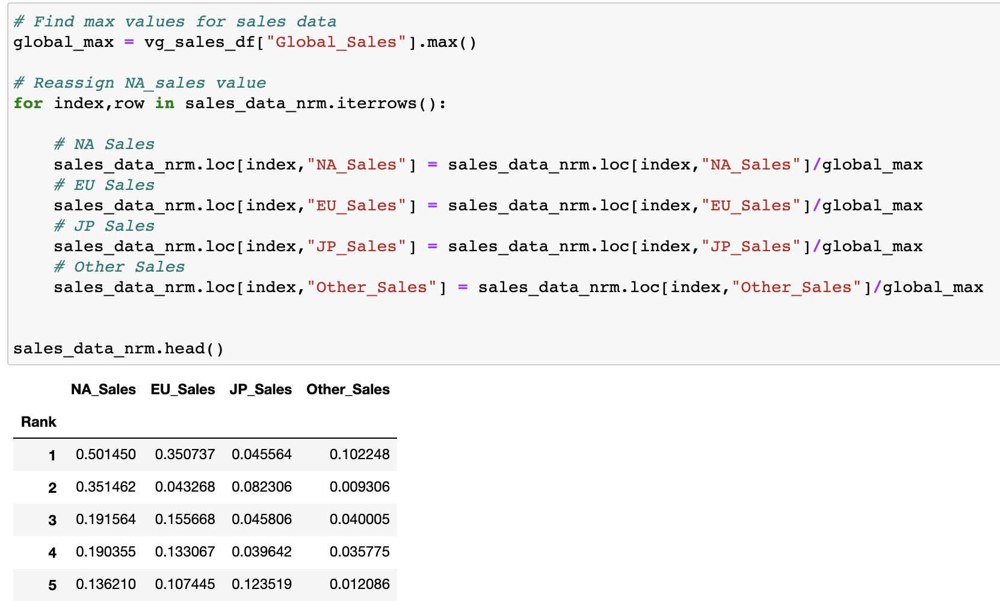

    

# Predicting Sales Using Machine Learning

# Segment One:

## Overview

Our goal is to predict sales of video games using Machine Learning (ML) based on sales outside of North America, genre, and video game platforms.

## Purpose

The gaming industry is immensely large and it is continuing to grow. As such, many companies want to be part of the growing revenue stream. Our task entails building a predictive ML model to find patterns in our existing data, and in new and unseen sales data. We believe that using ML will allow us to leverage existing algorithms to learn from the data and lead us to more accurate predictions.

To accomplish this task, we will build and evaluate several ML models or algorithms (e.g.,Logistic regression, Neural Network). Once we implement the algorithms, we will evaluate the performance to see how well the models predict the data. Our main goal is to market our algorithm to existing companies in the gaming sector or organizations looking to get involved in the industry.

## Resources

The technologies planned to be used for this project include the following:

- Python & Pandas library
- PostgreSQL & pgAdmin 
- mlenv (Numpy, SciPy, Scikit-Learn)
- Imbalanced-learn Package
- Tableau
- JavaScript

## Communication Protocol

To prepare for this project, a team of analysts referred to as the "Red Team" created the following communication protocol: 

- Discuss role distribution
- Use Slack channel to schedule meetings, discuss opinions and findings 
- Inform the acting leader via Slack or text message on schedule conflicts
- Ask for help when stuck on an individual task
- Inform the acting leader if the task will be completed late
- Inform the acting leader when emergency task reassignment will need to take place
- Praise a team member for good work
- Team leader will update team members of any changes due to emergencies or a team member needing help with a task
- Maintain open communication and active listening to prevent conflicts 

## Reason for Topic Selection

Predicting video game sales was considered to be an interesting and fun topic to analyze. Video games have been around for many years and have evolved significantly over time. Game development is also becoming increasingly common in many organizations. It is also a huge market that provides entertainment for children and adults alike. 

## Data Description

The CSV dataset has 16,599 rows and 11 columns. The dataset contains the following columns:
- Rank: The ranking of overall sales
- Name: The name of the games
- Platform: The platform of the games release
- Year: The year the game was released
- Genre: The genre of the game
- Publisher: The publisher of the game
- Sales (NA, EU, JP, Other, Global): Sales in North America, Sales in Europe, Sales in Japan, Sales in the rest of the world, and Total worldwide sales

## Project Question

We have launched a game (genre/platform) in NA, EU, JP. We have sales data for those regions, and we want to know if it would be profitable to launch in the rest of the world (Other_Sales).

## Machine Learning Model

We plan to investigate Logistic Regression and Neural Network and assess both for accuracy and computation time. One advantage to Logistic Regression is that we could use it without binning the sales data and encode the categorical variables. The neural network on the other hand may give us better accuracy, but we would need to bin the sales data. 

To apply the model, we will determine a threshold desired sales amount for North America. This would become our target. So we would bin the sales data for the rest of the world, and categorize the NA_Sales data as a greater than threshold or less than threshold. For example, we can pick $500,000 in sales; Our NA_Sales column would become "NA_Sales_greater_than_0.5" (since the data is in $ Millions), and we would get a 0 or 1 for each entry. That way, we reduce it to a binary classification problem.

## GitHub Repository Management

For better management and organization of the repository, the team agreed to create feature branches of project versus individual branches for team members. As a result, we submit (add) any documents to designated feature branches of the project, and provide detailed description on “commit” message.

#### Note: 

- **Schema image is located in database_game branch**
- **Machine Learning code is located in machine_learning_model_game branch**

## References

- <https://www.kaggle.com/gregorut/videogamesales?select=vgsales.csv>, accessed 2 July, 2021.

- <https://techcrunch.com/2015/10/31/the-history-of-gaming-an-evolving-community/>, accessed 3 July, 2021.

## End of Segment One

# Segment Two:

## Overview

The team made great strides in building the different pieces of the project. All members continue to evaluate what is and is not working during progress of the project.

## Communication Protocols

The team’s communication protocols will be relatively similar for all segments of the project. The team is aware of the importance of communicating with each other in order to achieve a successful outcome. The members will continue to respect lines communication, address any disagreements early on, and collectively work on assignments distributed according to function and expertise. 

For segment two, the following communication protocols were established:

- Discuss the team’s goals and objectives during the given segment
- Roles and requirements are clearly defined
- Set regular communication goals, types, and schedules
- Increase group meetings via Zoom to clearly define scope, resources, and timeline
- Continue group messages in Slack 
- Milestone status is regularly reported to the team
- Attend office hours to ask questions and ensure the project is on the right track
- Motivate each other
- Recognize and praise a member’s great work

## Machine Learning Model

During this segment, the team transitioned the mockup ML model to a functioning model. The team strategically selected which columns to drop and keep to run the model. The features to make the prediction and target to predict the outcome remained the same from the mockup model. The string columns were encoded into numerical values, and the numerical values in remaining columns were standardized. 

#### Sales Columns Before Standardization

#### Sales Columns After Standardization

**Description of preliminary data preprocessing**

**Description of preliminary feature engineering and preliminary feature selection, including their decision-making process**

**Description of how data was split into training and testing sets**

**Explanation of model choice, including limitations and benefits**

## Project Outline

**Why did you start?**

This project was started 
**What did you do?**

**What did you find?**

**What does it mean?**

## Google Slides
https://docs.google.com/presentation/d/1wRn_DMTICQlc5AWBJ5g96msv_DWjqQZWoBNYVVqalm4/edit?usp=sharing

## Storyboard
https://docs.google.com/presentation/d/1xscv3WHg-kAVCQeLhKaqSvw58ImNI4yrhc5Y1BQruPc/edit?usp=sharing

