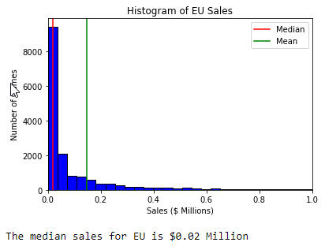
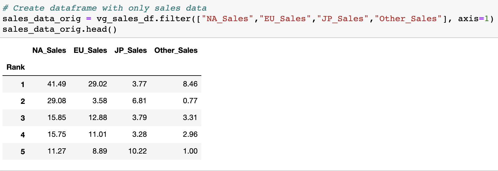
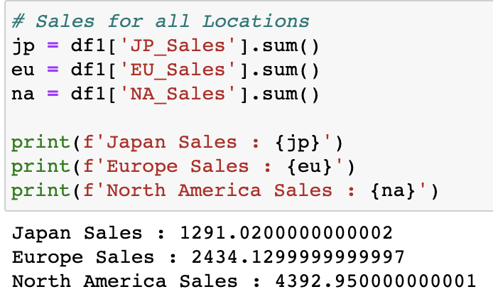

    

# Predicting Sales Using Machine Learning

## Overview

The video games industry continues to grow at a rapid pace, and shows no signs of slowing down in the years to come. As a result, many companies want to be part of the growing revenue stream. 

A team of data analytics consultants, referred to as the "Red Team," has been tasked to transform data into information that provides profit-maximizing business insight for video game sales. To accomplish this task, the team will build and evaluate several ML models or algorithms (e.g.,Logistic regression, Neural Network). Using ML will enable the team to leverage existing algorithms to learn from the data and lead to more accurate predictions.

## Purpose

For this project, the team will analyze the potential profits for a video game launch in the European region. The team will build a predictive ML model to find patterns in existing and new sales data. Once the model is created, its performance will be evaluated to see how well it predicts the data. 

In addition, the team will attempt to market the algorithm to existing companies in the gaming sector or organizations looking to get involved in the industry.

## Resources

-  VS Code

-  Python Libraries

-  PostgreSQL & pgAdmin

-  Machine Learning 

-  Tableau Public  

-  JavaScript

-  Heroku

## Communication Protocol

The team’s communication protocol will be relatively similar for all segments of the project. The team is aware of the importance of communicating with each other in order to achieve a successful outcome. The members will continue to respect lines communication, address any disagreements early on, and collectively work on assignments distributed according to function and expertise. The following communication protocol was established:

- Roles and requirements are clearly defined
- Use Slack channel to schedule meetings, discuss opinions, and findings 
- Inform the acting leader via Slack or text message on schedule conflicts
- Ask for help when stuck on an individual task
- Recognize and praise a member’s great work
- Maintain open communication and active listening to prevent conflicts 
- Schedule group meetings via Zoom as needed 
- Milestone status is regularly reported to the team
- Motivate each other

## Reason for Topic Selection

Predicting video game sales was considered to be an interesting and fun topic to analyze. Video games have been around for many years and have evolved significantly over time. Game development is also becoming increasingly common in many organizations. It is also a huge market that provides entertainment for children and adults alike. 

## Data Description

A CSV dataset, named vgsales.csv, will be used for the analysis. The dataset contains 16,599 rows and the following columns: 

- Rank: The ranking of overall sales
- Name: The name of the games
- Platform: The platform of the games release
- Year: The year the game was released
- Genre: The genre of the game
- Publisher: The publisher of the game
- Sales (NA, EU, JP, Other, Global): Sales in North America, Sales in Europe, Sales in Japan, Sales in the rest of the world, and Total worldwide sales

## Project Question

**Will sales in Europe be greater than the target revenue?**

## Machine Learning Model

#### Description of data preprocessing

The data was initially explored to determine which columns to keep as features and which columns to drop. The following are the columns dropped and retained for analysis.

- Dropped columns: Name, Year, Publisher, Other_Sales, Global Sales.
- Retained columns: Platform, Genre, NA_Sales, EU_Sales, JP_Sales

The columns Name and Publisher were dropped due to a large number of unique values and not very useful for the ML model. The Global_Sales column was dropped because it is a sum of the regional sales numbers. The team debated whether or not to keep Other_Sales column, but ultimately it was dropped. The Other_Sales column represented all sales outside of NA, EU, and JP, and the team felt that in a real-world application, this data would likely not be available prior to launching a video game in a major market. The data that was kept for analysis was reviewed for null values. Fortunately, no null values were found, so the team proceeded with the analysis.

#### Description of feature engineering and feature selection, including their decision-making process

The team strategically selected which columns to drop and keep to properly train the ML model. The features to make the prediction and target to predict the outcome changed from the original mockup model. The string columns were encoded into numerical values. Scaling was explored with the sales data, but it was found that scaling did not improve the accuracy of the ML model. The team believes this could be due to the heavily skewed distribution of the sales data as indicated by the EU_Sales histogram below. Further investigation is required.

#### Histogram of EU_Sales

#### Sales Data Columns

#### Total Regional Sales

#### Description of how data was split into training and testing sets

The data was split into the training and testing sets using the *train_test_split*

#### Model choice, including limitations and benefits

After lengthy consideration, the team elected to go with a Logistic Regression model for this data. The Logistic Regression model was chosen because the question the team is trying to answer is a binary classification problem for which Logistic Regression is well-suited. The Logistic Regression model is advantageous in this case because it is easy to implement and easy to understand. Furthermore, the data includes a limited number of features prior to categorical variable encoding, and the team was concerned that a complex model might overfit the data as a result. 

One potential drawback to Logistic Regression model is related to the size of the data and the convergence of the model. Several optimizers were explored with the Logistic Regression model, and it was found that some optimizers required a significant number of iterations for the model to converge. Hyperparameter tuning was also investigated in an attempt to improve the model performance, but the team observed that there was not much to be gained in terms of model accuracy via hyperparameter tuning.

#### Explanation of changes in model choice (if changes occurred between the Segment 2 and Segment 3 deliverables) 

#### Description of how they have trained the model thus far, and any additional training that will take place 

#### Description of current accuracy score

#### How the model addresses the question

## QuickDBD Mockup

ERD:

### Database layout and Design

The team has decided to utilize Heroku for the online database. After cleaning the data and considering the constraints from Heroku regarding row limits, the data was divided into three categories: games, platforms, and genres. Once these categories were established, three CSV files were generated (using vg_db_csv_creator.ipynb) to populate the table data in pgAdmin and uploaded into the Heroku database.    

CSV Data Imported into pgAdmin:

Data Uploaded into Heroku:

After the data was loaded into Heroku, a connection was established using heroku_db_connection.ipynb. Using SQL to query the online database, the team was able to perform two LEFT JOINS and reconstruct the data needed for the machine learning and pass it into the logistic regression model for processing.

## Google Slides
https://docs.google.com/presentation/d/1wRn_DMTICQlc5AWBJ5g96msv_DWjqQZWoBNYVVqalm4/edit?usp=sharing

## Storyboard
https://docs.google.com/presentation/d/1xscv3WHg-kAVCQeLhKaqSvw58ImNI4yrhc5Y1BQruPc/edit?usp=sharing

## Preliminary Tableau
https://public.tableau.com/app/profile/jacqueline.esbri/viz/FinalProjectTeamRedPresentation_16270732094330/TitlePage?publish=yes

## References

- <https://www.kaggle.com/gregorut/videogamesales?select=vgsales.csv>, accessed 2 July, 2021.

- <https://techcrunch.com/2015/10/31/the-history-of-gaming-an-evolving-community/>, accessed 3 July, 2021.

- <https://github.com/get-icon/geticon/raw/master/icons/visual-studio-code.svg>, accessed 15 July, 2021.

- <https://github.com/get-icon/geticon/raw/master/icons/python.svg>, accessed 15 July, 2021.

- <https://github.com/get-icon/geticon/raw/master/icons/postgresql.svg>, accessed 15 July, 2021.

- <https://maxgentechnologies.com/images/intern/python_machine_logo.jpg>, accessed 15 July, 2021.

- <https://encrypted-tbn0.gstatic.com/images?q=tbn:ANd9GcSLPEwocsaSWuRA1_rvsYXMsXCMzgSWVB956N1CKMQ&usqp=CAU>, accessed 15 July, 2021.

- <https://github.com/get-icon/geticon/raw/master/icons/javascript.svg>, accessed 15 July, 2021.

- <https://brand.heroku.com/static/media/heroku-logotype-spacing-vertical.dc54b577.svg>, accessed 15 July, 2021.
