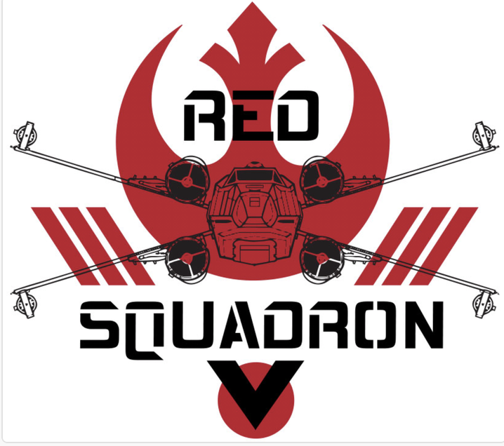

# Predicting Sales Using Machine Learning

### Communication Protocol
To prepare for this project, the team of analysts referred to as the "Red Team" created a communication protocol that includes the following:

- Post team meeting schedule and invitation information on Slack.
- Inform the acting leader via Slack, text message, or other social media outlets when absent from a scheduled meeting.
- Ask for help when stuck on an individual task.
- Inform the acting leader if the task will be completed late.
- Inform the acting leader if an emergency situation presents itself and the team needs to complete the task.
- Praise a team member for a work well done.
- Team leader will update team members of any changes due to emergencies or a team member needing help with a task.
